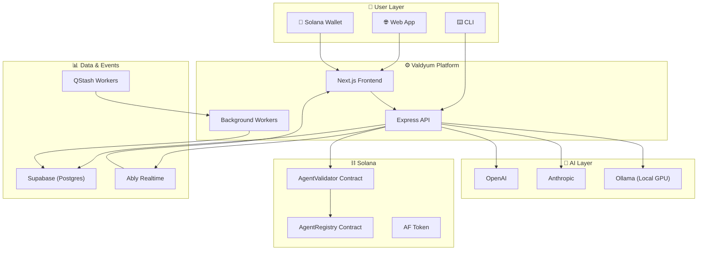
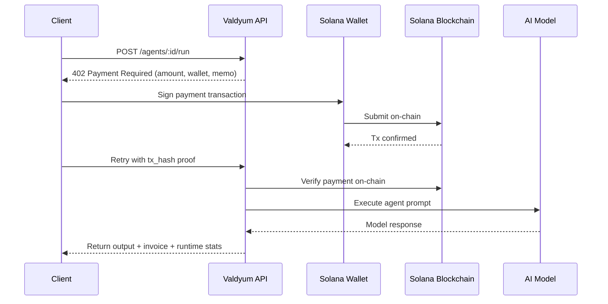

<div align="center">


<br />
<br />

### Build, Deploy & Monetize AI Agents On-Chain

[](https://solana.com)
[](https://typescriptlang.org)
[](https://nextjs.org)
[](https://rust-lang.org)
[](LICENSE)

<br />

An infrastructure layer on Solana for building, deploying, and monetizing autonomous agents, with optimized local GPU execution for reliable performance.

<br />

[Website](https://valdyum.vercel.app) &nbsp;·&nbsp; [Video Demo](https://www.loom.com/share/f4e989d847ca4beb9b104e4a5d4c8ae4) &nbsp;·&nbsp; [Documentation](docs/) &nbsp;·&nbsp; [CLI Guide](docs/CLI_GUIDE.md)

</div>

<br />

---

<br />

## 🧠 Why Valdyum?

Today's AI agents live behind walled gardens — centralized APIs, opaque billing, zero ownership. There's no way for an independent builder to deploy an agent and get paid transparently every time it runs.

**Valdyum changes that.**

We give every AI agent a **wallet, an identity, and a price tag** — all anchored on Solana. When someone runs your agent, they pay on-chain. When you fork someone else's agent, the original creator earns. Every execution is verifiable. Every builder is an owner.

```
You build it → You deploy it on-chain → You set the price → You earn every time it runs.
```

<br />

### The Problem We're Solving

| Traditional AI Platforms | What's Broken |
|---|---|
| API keys & subscriptions | No atomic link between payment and execution |
| Centralized billing dashboards | Zero transparency — you trust the platform, not the chain |
| Off-chain usage logs | No way for two autonomous agents to pay each other |
| Walled ecosystems | Builders don't own their agents — the platform does |

### The Valdyum Answer

| Valdyum Approach | Why It Matters |
|---|---|
| Every run triggers an on-chain payment | Payment and execution are **atomic** — one can't happen without the other |
| Agents have on-chain identities | You **own** your agent, provably, with wallet-signed registration |
| 0x402 protocol for machine payments | Any client (human or bot) can pay for any agent — **no API keys needed** |
| Fork economy with creator royalties | Original builders **earn** when their agents get forked and run |

<br />

---

<br />

## ⚡ How It Works

Valdyum orchestrates every agent through **5 interconnected pipelines** — from creation to payment to trust verification.

<br />

<div align="center">

<br />
<sub><i>Complete agent lifecycle — from CLI to on-chain settlement</i></sub>
</div>

<br />

---

### Pipeline I — CRUD

> Agent lifecycle management

Agents are first-class entities with unique IDs, stored in Postgres. Create, read, update, delete — everything flows through the agent registry and back to your terminal.

<div align="center">

</div>

<br />

---

### Pipeline II — GPU Compute

> Local-first AI inference

The CLI dispatches compute to your GPU via ROCm, routes through Ollama for LLM execution, and streams metrics back in real-time. No cloud dependency required.

<div align="center">

</div>

<br />

---

### Pipeline III — Trust Layer (T54)

> Tamper-proof identity verification

Every agent identity is verified through T54. Audits and executions are cross-referenced via the ClawCredit facilitator, creating a tamper-proof trust graph that ensures no agent can impersonate another.

<div align="center">

</div>

<br />

---

### Pipeline IV — Developer Toolkit

> End-to-end developer flow

Scaffold agent folders, validate pricing, configure endpoints, run sandboxed tests, deploy, and stream tasks — all from your terminal. Everything a developer needs to go from idea to deployed agent.

<div align="center">

</div>

<br />

---

### Pipeline V — 0x402 Payment Protocol

> Pay-per-request, trustlessly

HTTP 402-based pay-per-request. Every agent API call automatically handles the payment challenge, Solana transaction verification, and retry execution — seamlessly. No subscriptions, no API keys, no trust assumptions.

<div align="center">

</div>

<br />

---

<br />

## 🏗️ Architecture

### System Overview



<br />

### Monorepo Structure

```
valdyum/
│
├── client/                  # Next.js 15 — Landing, Marketplace, Builder, Dashboard
│   ├── app/                 # App Router pages & layouts
│   ├── components/          # Reusable UI components
│   ├── hooks/               # Custom React hooks
│   ├── lib/                 # Client-side utilities
│   └── types/               # TypeScript type definitions
│
├── server/                  # Express — API, CLI, Background Workers
│   ├── src/
│   │   ├── cli/             # $ valdyum CLI tool (Commander.js)
│   │   ├── routes/          # REST API route handlers
│   │   ├── workers/         # QStash async consumers
│   │   └── scripts/         # Setup & migration scripts
│   ├── Dockerfile           # Production container
│   └── supabase-schema.sql  # Database schema
│
├── contracts/               # Solana Smart Contracts
│   ├── agent_validator/     # Deployment gating & signature verification
│   ├── agent_registry/      # On-chain agent index & ownership
│   ├── af_token/            # Platform token contract
│   └── deploy-solana.sh     # Contract deployment script
│
├── agents-sdk/              # Rust-based Agent Templates & SDK
│   ├── common/              # Shared agent utilities
│   ├── trading_bot/         # Automated trading strategies
│   ├── mev_bot/             # MEV detection & extraction
│   ├── arbitrage_tracker/   # Cross-DEX arbitrage
│   ├── mempool_monitor/     # Real-time mempool analysis
│   ├── liquidity_slippage_tracker/  # Liquidity monitoring
│   ├── relayer/             # Transaction relay service
│   └── templates/           # Agent scaffolding templates
│
├── packages/shared/         # Shared types & utilities across workspaces
├── docs/                    # Architecture docs, CLI guide, deployment guide
├── docker-compose.yml       # Full-stack container orchestration
└── pnpm-workspace.yaml      # Monorepo workspace config
```

<br />

---

<br />

## 🖥️ Platform Surfaces

Valdyum isn't just a protocol — it's a full product. Here's what ships:

### 🏪 Agent Marketplace
Browse, fork, and execute community-built agents. Every fork is a paid on-chain transaction — the original creator earns royalties. Search by model, category, price, and rating.

### 🔨 Agent Builder
Visual and CLI-based agent configuration. Pick your model (GPT-4, Claude, Llama), write your system prompt, set pricing, configure tools, and deploy on-chain with a single wallet signature.

### 📊 Analytics Dashboard
Real-time request velocity, revenue tracking, billing aggregations, and latency metrics. Every data point can be reconciled against the on-chain explorer for full transparency.

### ⚡ Workflow Executor
Chain multiple agents together into paid task pipelines. Each step requires wallet approval. Invoice cards provide tx hash, amount, timestamp, and direct explorer links.

### 📈 Trading Surface
Purpose-built for DeFi agents. Wallet-aware controls, real-time market data, and strategy execution — all tied to on-chain agent identities.

### 🔧 CLI Developer Tool
The power-user interface. Full agent lifecycle management from your terminal — sandbox testing, 0x402 auto-payment handling, multi-agent pipeline orchestration, and ClawCredit integration.

<br />

---

<br />

## 🚀 Getting Started

### Prerequisites

| Requirement | Version | Purpose |
|-------------|---------|---------|
| Node.js | 18+ | Runtime |
| pnpm | 10+ | Package manager |
| Solana Wallet | Any | Phantom, Freighter, or Backpack |
| Supabase | — | Database (optional for local dev) |
| Ollama | — | Local GPU inference (optional) |

### Install & Run

```bash
# Clone the repository
git clone https://github.com/SATISH-JALAN/Valdyum-Labs.git
cd Valdyum-Labs

# Install all workspace dependencies
pnpm install

# Set up your environment
cp .env.example .env.local
# Fill in your API keys — never commit secrets

# Start the full stack (client + server)
pnpm dev
```

| Service | URL | Description |
|---------|-----|-------------|
| Client | `http://localhost:3000` | Web application |
| Server | `http://localhost:3001` | API + CLI backend |

### Individual Services

```bash
pnpm dev:client    # Start only the frontend
pnpm dev:server    # Start only the backend
pnpm workers       # Start background workers
```

<br />

---

<br />

## ⌨️ CLI Reference

Valdyum ships with a powerful CLI for managing agents directly from your terminal.

### Agent Commands

```bash
# List all marketplace agents
pnpm valdyum agents:list

# Test an agent in sandbox mode (free, no payment required)
pnpm valdyum agents:sandbox --id <agent-id> --prompt "your test query"

# Run an agent with automatic 0x402 payment
pnpm valdyum agents:run --id <agent-id> --prompt "execute strategy"
```

### Payment & Transaction Commands

```bash
# Check on-chain transaction status
pnpm valdyum tx:status --hash <tx_signature>

# View ClawCredit balance and status
pnpm valdyum clawcredit:status

# Make a ClawCredit payment
pnpm valdyum clawcredit:pay --url <merchant-url> --amount 150.00
```

### Dashboard Commands

```bash
# Open the dashboard
pnpm valdyum dashboard:open

# Print infrastructure status as JSON
pnpm valdyum dashboard:status
```

### Example: Full Agent Execution

```
$ pnpm valdyum agents:run -i agent-1234 -p "execute MEV strategy"

⠋ Executing agent...
  ✓ Credentials validated
  ✓ Request prepared
⠙ Checking payment requirement...
✓ Payment required: 0.05 SOL
⠸ Signing transaction...
✓ Transaction signed
⠼ Broadcasting to Solana...
✓ Payment confirmed: 7BzRz6CZ...
⠴ Running agent with payment proof...
✓ Agent execution complete (1.2s)

{
  "status": "success",
  "result": "MEV opportunity detected and executed...",
  "cost": "0.05 SOL",
  "tx": "7BzRz6CZ..."
}
```

> 📖 Full CLI documentation: [docs/CLI_GUIDE.md](docs/CLI_GUIDE.md)

<br />

---

<br />

## 📡 API Reference

All agent operations are available as REST endpoints:

| Method | Endpoint | Description |
|--------|----------|-------------|
| `POST` | `/api/agents/create` | Register a new agent |
| `GET` | `/api/agents/list` | Browse marketplace agents |
| `GET` | `/api/agents/:id` | Get agent details & metadata |
| `POST` | `/api/agents/:id/run` | Execute agent (triggers 0x402 payment flow) |
| `POST` | `/api/agents/validate-deploy` | Initiate on-chain deployment validation |
| `POST` | `/api/agents/confirm-deploy` | Finalize deployment with wallet signature |
| `POST` | `/api/agents/submit-confirmation` | Submit signed confirmation tx |
| `POST` | `/api/payment/verify` | Verify an on-chain payment |
| `GET` | `/api/dashboard/analytics` | Builder analytics & revenue data |
| `GET` | `/api/dashboard/requests` | Request history & billing |
| `GET` | `/api/ably/token` | Get realtime auth token |

<br />

---

<br />

## 🔗 The 0x402 Protocol

Every paid agent execution follows this trustless protocol:



**Why this matters:**
- **No API keys** — the blockchain IS your authentication
- **No subscriptions** — pay exactly for what you use
- **No trust assumptions** — verify any payment on-chain yourself
- **Machine-compatible** — any bot or script can pay for any agent

<br />

---

<br />

## ⛓️ Smart Contracts

### AgentValidator
Gatekeeper for all agent deployments. Validates deploy intent, manages pending deployment state, and performs inter-contract calls into the registry upon wallet-signed confirmation.

### AgentRegistry
The canonical on-chain index for every registered agent. Stores pricing, ownership metadata, and request accounting hooks. Serves as the single source of truth for all validator cross-contract checks.

### AF Token
The native platform token for governance, staking, and premium features.

### Deployment Flow

```
User configures agent in Builder / CLI
  → API builds unsigned validation transaction
    → Wallet signs the validation tx
      → API submits to Solana
        → AgentValidator.confirm_deploy()
          → invokes AgentRegistry.register_agent()
            → Agent metadata persisted to Supabase
              → Agent is live on-chain ✅
```

<br />

---

<br />

## 🛠️ Tech Stack

| Layer | Technology | Purpose |
|---|---|---|
| **Frontend** | Next.js 15, React 18, TailwindCSS | App Router, SSR, responsive UI |
| **Animations** | GSAP, Framer Motion, Lenis | Premium scroll animations & transitions |
| **Backend** | Express, TypeScript | REST API, route handlers |
| **CLI** | Commander.js, Chalk, Ora | Terminal agent management |
| **Blockchain** | Solana, Anchor | On-chain registry, payments, validation |
| **AI (Cloud)** | OpenAI, Anthropic | GPT-4, Claude model inference |
| **AI (Local)** | Ollama, ROCm | Local GPU inference — no cloud needed |
| **Database** | Supabase (PostgreSQL) | Agent data, requests, invoices, analytics |
| **Realtime** | Ably | Live event streaming to dashboard |
| **Workers** | Upstash QStash | Background job processing |
| **Trust** | T54 Labs, ClawCredit SDK | Identity verification, credit facilitation |
| **Agent SDK** | Rust, Cargo | Pre-built agent templates |
| **DevOps** | Docker, GitHub Actions | CI/CD, container builds |

<br />

---

<br />

## 🧱 What You Can Build

Valdyum ships with **production-ready Rust agent templates** in the `agents-sdk/`:

| Agent | Description | Directory |
|-------|-------------|-----------|
| 🤖 **Trading Bot** | Automated on-chain trading strategies with configurable parameters | `agents-sdk/trading_bot` |
| ⚡ **MEV Bot** | Mempool monitoring, sandwich detection, and MEV extraction | `agents-sdk/mev_bot` |
| 📊 **Arbitrage Tracker** | Cross-DEX price monitoring and arbitrage opportunity detection | `agents-sdk/arbitrage_tracker` |
| 🔍 **Mempool Monitor** | Real-time transaction stream analysis and alerts | `agents-sdk/mempool_monitor` |
| 💧 **Liquidity Tracker** | Liquidity pool monitoring and slippage estimation | `agents-sdk/liquidity_slippage_tracker` |
| 🔄 **Relayer** | Transaction relay, routing, and resubmission service | `agents-sdk/relayer` |
| 🛠️ **Custom Agent** | Start from scratch with CLI scaffolding — bring your own logic | `pnpm valdyum agents:create` |

<br />

---

<br />

## 🌐 Ecosystem

<div align="center">

<br />

**Solana** &nbsp;·&nbsp; **T54 Labs** &nbsp;·&nbsp; **ClawCredit** &nbsp;·&nbsp; **Jupiter** &nbsp;·&nbsp; **Helius** &nbsp;·&nbsp; **Pyth** &nbsp;·&nbsp; **Birdeye** &nbsp;·&nbsp; **Supabase** &nbsp;·&nbsp; **Ably**

<br />

</div>

<br />

---

<br />

## 🔐 Security

- All API keys and secrets remain **server-side only** — never exposed to the client
- `.env.local` and all backup files are **git-ignored**
- Every payment requires an **explicit wallet signature** from the user
- Payment verification is **externalized to Solana** — the chain is the source of truth
- CI/CD pipeline enforces linting, type-checking, and build integrity on every push
- If any key is ever exposed, **rotate immediately**

<br />

---

<br />

## 🔄 CI/CD

Automated via GitHub Actions (`.github/workflows/ci.yml`):

| Stage | Check | Purpose |
|-------|-------|---------|
| **Lint** | ESLint (strict mode) | Code quality enforcement |
| **Types** | TypeScript `--noEmit` | Type safety verification |
| **Build** | Next.js production build | Build integrity + artifact upload |
| **Docker** | Buildx image build | Container deploy parity |

<br />

---

<br />

## 🤝 Contributing

We welcome contributions from the community.

```bash
# Fork the repo, then:
pnpm install
pnpm dev

# Before submitting a PR:
pnpm lint                    # ESLint
pnpm exec tsc --noEmit       # Type check
pnpm build                   # Production build
```

<br />

---

<br />

<div align="center">


<br />
<br />

**Valdyum Labs**

*Every agent has a wallet. Every execution has a price. Every builder is an owner.*

<br />

[Website](https://valdyum.vercel.app) &nbsp;·&nbsp; [Docs](docs/) &nbsp;·&nbsp; [CLI Guide](docs/CLI_GUIDE.md) &nbsp;·&nbsp; [Demo Video](https://www.loom.com/share/f4e989d847ca4beb9b104e4a5d4c8ae4)

</div>
